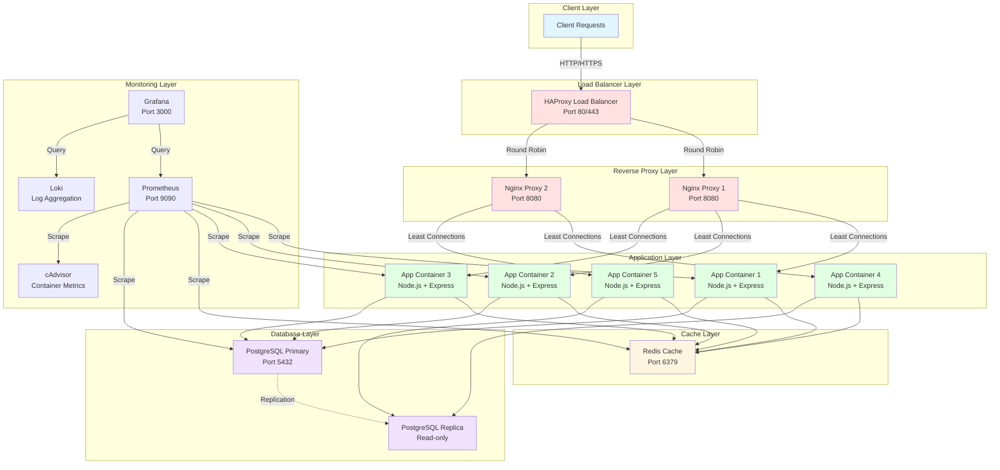
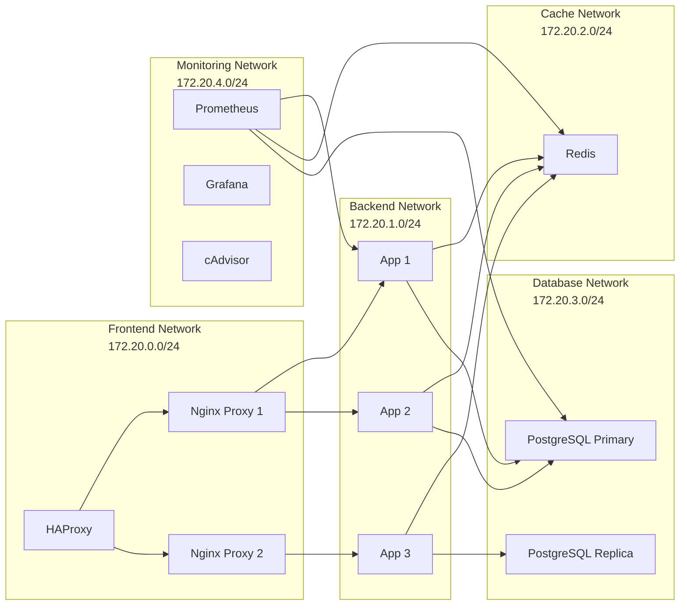

# 🏗️ Architecture Documentation

## System Overview

Professional hosting platform built on Docker Swarm with complete automation, monitoring, and operational procedures.

---

## Architecture Diagram



---

## Network Topology



---

## Container Overview

| Container | Image | Exposed Ports | Volumes | Networks | CPU Limit | Memory Limit | Purpose |
|-----------|-------|---------------|---------|----------|-----------|--------------|---------|
| **haproxy** | haproxy:2.9-alpine | 80, 443, 8404 | haproxy_ssl | proxy_net | 1.0 | 512MB | Load balancing and SSL termination |
| **nginx-proxy-1** | custom/nginx:alpine | 8080 | nginx_cache, nginx_logs | proxy_net, app_net | 0.5 | 256MB | Reverse proxy and caching |
| **nginx-proxy-2** | custom/nginx:alpine | 8080 | nginx_cache, nginx_logs | proxy_net, app_net | 0.5 | 256MB | Reverse proxy and caching |
| **app-1** | hosting-app:latest | 3000 | - | app_net, cache_net, db_net, monitor_net | 2.0 | 1GB | Application server instance 1 |
| **app-2** | hosting-app:latest | 3000 | - | app_net, cache_net, db_net, monitor_net | 2.0 | 1GB | Application server instance 2 |
| **app-3** | hosting-app:latest | 3000 | - | app_net, cache_net, db_net, monitor_net | 2.0 | 1GB | Application server instance 3 |
| **postgres-primary** | postgres:16-alpine | 5432 | postgres_data | db_net, monitor_net | 2.0 | 2GB | Primary PostgreSQL database |
| **postgres-replica** | postgres:16-alpine | 5432 | postgres_replica_data | db_net, monitor_net | 2.0 | 2GB | Read replica PostgreSQL |
| **redis** | redis:7.2-alpine | 6379 | redis_data | cache_net, monitor_net | 1.0 | 512MB | Cache and session storage |
| **prometheus** | prom/prometheus:latest | 9090 | prometheus_data | monitor_net, app_net, db_net | 1.0 | 1GB | Metrics collection |
| **grafana** | grafana/grafana:latest | 3000 | grafana_data | monitor_net | 0.5 | 512MB | Metrics visualization |
| **loki** | grafana/loki:latest | 3100 | loki_data | monitor_net | 1.0 | 512MB | Log aggregation |
| **promtail** | grafana/promtail:latest | - | /var/lib/docker | monitor_net | 0.25 | 128MB | Log collection |
| **cadvisor** | gcr.io/cadvisor/cadvisor:latest | 8080 | /sys, /var/lib/docker | monitor_net | 0.5 | 256MB | Container metrics |

---

## Volume Mapping

| Volume Name | Type | Driver Options | Purpose | Backup Strategy |
|-------------|------|----------------|---------|-----------------|
| postgres_data | NFS | addr=10.0.1.20,nfsvers=4 | Primary database data | Daily dumps + volume snapshots |
| postgres_replica_data | NFS | addr=10.0.1.20,nfsvers=4 | Replica database data | Weekly snapshots |
| redis_data | NFS | addr=10.0.1.20,nfsvers=4 | Cache persistence | Daily snapshots |
| prometheus_data | Local | - | Metrics retention (30 days) | Weekly snapshots |
| grafana_data | Local | - | Dashboards and settings | Weekly backups |
| nginx_cache | Local | - | HTTP cache | No backup needed |
| nginx_logs | Local | - | Access/error logs | Log rotation |
| loki_data | Local | - | Log storage | 7 day retention |

---

## Scaling Strategy

### Horizontal Scaling

**Application Containers:**
- Development: 3 replicas
- Production: 5-10 replicas
- Auto-scaling: Based on CPU/Memory metrics (Docker Swarm or Kubernetes)

**Load Balancing:**
- HAProxy: Round-robin distribution to Nginx proxies
- Nginx: Least connections to application containers
- Health checks every 10 seconds

### Vertical Scaling

**Resource Allocation per Environment:**

| Component | Development | Staging | Production |
|-----------|-------------|---------|------------|
| App Container | 1 CPU, 512MB | 2 CPU, 1GB | 2 CPU, 2GB |
| PostgreSQL | 2 CPU, 1GB | 2 CPU, 2GB | 4 CPU, 4GB |
| Redis | 0.5 CPU, 256MB | 1 CPU, 512MB | 1 CPU, 1GB |

### Database Scaling

**Read Replicas:**
- 1 Primary (writes)
- 1+ Replicas (reads)
- Application routing: Writes to primary, reads to replicas
- Replication lag monitoring via Prometheus

---

## Deployment Strategies

### Docker Compose (Development)

```bash
docker-compose up -d
docker-compose scale app=5
```

### Docker Swarm (Production)

```bash
docker stack deploy -c docker-compose.prod.yml hosting
docker service scale hosting_app=10
```

### Kubernetes (Advanced - Optional)

```bash
kubectl apply -f k8s/
kubectl scale deployment app --replicas=10
```

---

## High Availability

### Component HA Strategy

| Component | HA Method | Recovery Time |
|-----------|-----------|---------------|
| Application | 5+ replicas across nodes | Instant (health check) |
| Load Balancer | HAProxy on 2+ nodes | < 5 seconds |
| Database | Primary + Replica with auto-failover | < 30 seconds |
| Redis | Persistent storage + quick restart | < 10 seconds |
| Monitoring | Dedicated node with restart policy | < 1 minute |

### Failure Scenarios

1. **App Container Failure**: Swarm immediately restarts, load balancer stops routing
2. **Database Primary Failure**: Promote replica to primary (manual or automated)
3. **Node Failure**: Swarm reschedules containers to healthy nodes
4. **Network Partition**: Services isolated by network continue operating independently

---

## Performance Characteristics

### Expected Metrics

| Metric | Target | Acceptable | Critical |
|--------|--------|------------|----------|
| Response Time (p95) | < 300ms | < 500ms | < 1000ms |
| Response Time (p99) | < 500ms | < 800ms | < 1500ms |
| Error Rate | < 0.1% | < 1% | < 5% |
| Throughput | 1000 req/s | 500 req/s | 200 req/s |
| Database Connections | < 50 | < 100 | < 150 |
| Cache Hit Ratio | > 80% | > 60% | > 40% |

### Capacity Planning

**Current Capacity (5 app replicas):**
- Concurrent Users: ~750
- Requests/second: ~400
- Database Load: 60% capacity

**Breaking Point:**
- Users: ~1000
- Response time degradation begins at 800 concurrent users
- Database becomes bottleneck at 180 connections

---

## Technology Stack

| Layer | Technology | Version | Purpose |
|-------|-----------|---------|---------|
| OS | Ubuntu Server | 22.04 LTS | Base operating system |
| Container Runtime | Docker | 24.x | Container execution |
| Orchestration | Docker Swarm | Built-in | Container orchestration |
| Load Balancer | HAProxy | 2.9 | Layer 7 load balancing |
| Reverse Proxy | Nginx | Alpine | HTTP reverse proxy |
| Application | Node.js + Express | 18 | REST API server |
| Database | PostgreSQL | 15 | Relational database |
| Cache | Redis | 7.2 | In-memory cache |
| Monitoring | Prometheus | Latest | Metrics collection |
| Visualization | Grafana | Latest | Metrics dashboards |
| Log Aggregation | Loki + Promtail | Latest | Centralized logging |
| IaC | Terraform | 1.x | Infrastructure provisioning |
| Configuration Mgmt | Ansible | Latest | Server configuration |
| CI/CD | GitHub Actions | - | Automated deployments |
| Load Testing | k6 | Latest | Performance testing |

---

## Network Configuration

### Docker Networks

| Network | Subnet | Driver | Purpose |
|---------|--------|--------|---------|
| proxy_net | 172.20.0.0/24 | bridge/overlay | Load balancer to proxies |
| app_net | 172.20.1.0/24 | bridge/overlay | Proxies to applications |
| cache_net | 172.20.2.0/24 | bridge/overlay | Applications to Redis |
| db_net | 172.20.3.0/24 | bridge/overlay | Applications to database |
| monitor_net | 172.20.4.0/24 | bridge/overlay | Monitoring infrastructure |

### Port Mappings

| Service | Internal Port | External Port | Protocol | Access |
|---------|---------------|---------------|----------|--------|
| HAProxy | 80, 443 | 80, 443 | HTTP/HTTPS | Public |
| HAProxy Stats | 8404 | 8404 | HTTP | Internal |
| Nginx | 8080 | - | HTTP | Internal |
| Application | 3000 | - | HTTP | Internal |
| PostgreSQL | 5432 | 5432 | TCP | Internal |
| Redis | 6379 | - | TCP | Internal |
| Prometheus | 9090 | 9090 | HTTP | Internal |
| Grafana | 3000 | 3001 | HTTP | Internal |
| cAdvisor | 8080 | 8080 | HTTP | Internal |

---

## Data Flow

### Request Flow

1. Client sends HTTP request → HAProxy (port 80/443)
2. HAProxy terminates SSL → Nginx Proxy (round-robin)
3. Nginx Proxy routes request → App Container (least connections)
4. App Container checks Redis cache
5. If cache miss → Query PostgreSQL
6. App Container returns response → Nginx → HAProxy → Client

### Monitoring Data Flow

1. Prometheus scrapes metrics from all services (15s interval)
2. Application exposes `/metrics` endpoint with custom metrics
3. cAdvisor provides container resource metrics
4. Grafana queries Prometheus for visualization
5. Loki aggregates logs from all containers via Promtail
6. Alerts trigger on threshold breaches (optional Alertmanager)

---

## Disaster Recovery

### Backup Strategy

| Component | Frequency | Retention | Method |
|-----------|-----------|-----------|--------|
| PostgreSQL | Daily | 30 days | pg_dump + volume snapshot |
| Redis | Daily | 7 days | RDB + AOF files |
| Application Data | Daily | 30 days | Volume backup |
| Configuration | On change | Indefinite | Git repository |

### Recovery Procedures

**RTO (Recovery Time Objective):** 30 minutes  
**RPO (Recovery Point Objective):** 24 hours

See `docs/operations/runbooks/06-restore-procedures.md` for detailed steps.

---

## Future Enhancements

1. **Kubernetes Migration**: Enhanced auto-scaling and orchestration
2. **Multi-Region Deployment**: Geographic redundancy
3. **CDN Integration**: Static asset delivery
4. **Auto-scaling**: CPU/Memory-based automatic scaling
5. **Service Mesh**: Istio/Linkerd for advanced traffic management
6. **Vault Integration**: Centralized secrets management
